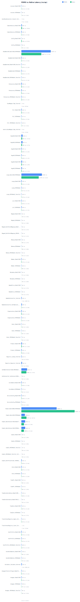
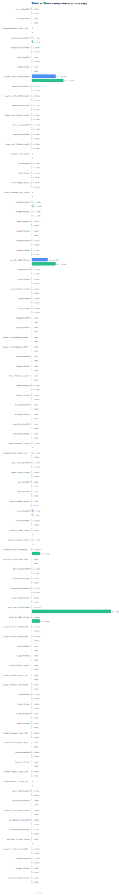

<div align="center">

# go-pbmo-benchmark

**Performance comparison between [go-pbmo] automated mapping and native hand-written conversion**

[go-pbmo]: https://github.com/kamalyes/go-pbmo

[](https://github.com/kamalyes/go-pbmo-benchmark/actions/workflows/benchmark.yml)

</div>

---

## 📊 Benchmark Charts

### Latency Comparison



### Memory Allocation



> Charts are auto-generated on every push via GitHub Actions.

---

## 🚀 Quick Start

```bash
# Run consistency tests first
go test -run="Test" -v -count=1 ./benchmarks

# Run all benchmarks
go test -run='^$' -bench=. -benchmem -count=3 -timeout=30m ./benchmarks

# Run benchmarks and save output (PowerShell)
go test -run='^$' -bench=. -benchmem -count=1 -timeout=10m ./benchmarks > benchmark_output.txt

# Generate charts + BENCHMARKS.md
go run ./bootstrap/report -parse benchmark_output.txt
```

---

## 📋 Overview

This repository contains comprehensive performance benchmarks comparing **go-pbmo**'s automated Protobuf ↔ Model conversion with hand-written native conversion code.

### Test Coverage

- ✅ **Simple Models** (4-6 fields) - Basic field type conversions
- ✅ **Medium Models** (8-13 fields) - Multi-type combinations
- ✅ **Complex Models** (20-30 fields) - Large enterprise models
- ✅ **Huge Models** (30/50/100 fields) - Extreme scale testing
- ✅ **Nested Models** (2-3 levels) - Embedded structures
- ✅ **Deep Nested** (4 levels) - Deep hierarchy
- ✅ **Wrappers** - `wrapperspb` conversions, time pointers, named slices
- ✅ **SQLBuilder Types** - `JSON[T]`, `Slice[T]`, `MapAny`, comprehensive

---

## 📁 Project Structure

```bash
go-pbmo-benchmark/
├── models/                      # Model definitions (按复杂度分类)
│   ├── simple.go               # 简单模型 (4-6 字段)
│   ├── medium.go               # 中等模型 (8-13 字段)
│   ├── complex.go              # 复杂模型 (20-30 字段)
│   ├── huge.go                 # 超大模型 (30/50/100 字段)
│   ├── nested.go               # 嵌套模型 (2-3 层)
│   ├── deep_nested.go          # 深度嵌套 (4-6 层)
│   ├── wrapper.go              # Wrapper 字段测试
│   └── sqlbuilder.go           # SQLBuilder types 集成测试
│
├── benchmarks/                  # Benchmark tests (按 models 对应结构)
│   ├── simple_bench_test.go    # 简单模型性能测试
│   ├── medium_bench_test.go    # 中等模型性能测试
│   ├── complex_bench_test.go   # 复杂模型性能测试
│   ├── huge_bench_test.go      # 超大模型性能测试 (30/50/100字段)
│   ├── nested_bench_test.go    # 嵌套模型性能测试
│   ├── deep_nested_bench_test.go # 深度嵌套性能测试
│   ├── wrapper_bench_test.go   # Wrapper/时间指针/命名切片性能测试
│   ├── sqlbuilder_bench_test.go # SQLBuilder types 性能测试
│   ├── *.svg                   # Auto-generated charts
│   └── *.json                  # Benchmark data
│
├── bootstrap/
│   └── report/
│       └── main.go             # Report + SVG chart generator
│
├── .github/workflows/
│   └── benchmark.yml           # CI auto-benchmark workflow
│
├── BENCHMARKS.md               # Detailed comparison tables
└── README.md                   # This file
```

---

## ⚙️ CI Automation

The [benchmark workflow](./.github/workflows/benchmark.yml) runs automatically on every push to `main`/`master`:

1. Runs `go test -bench` with 5 iterations
2. Parses results and generates SVG charts
3. Commits updated charts + `BENCHMARKS.md` back to the repo

---

## 📋 Full Data

See [BENCHMARKS.md](./BENCHMARKS.md) for detailed comparison tables with all scenarios.

---

## 🎯 Benchmark Scenarios

### 1. Simple Models (4-6 fields)

- **SimplePB** → **SimpleModel** (4 fields: ID, Name, Email, Age)
- **AccountInfoPB** → **AccountInfoModel** (5 fields + timestamps)
- **MappedPB** → **MappedModel** (3 fields with custom mapping)

### 2. Medium Models (8-13 fields)

- **MemberProfilePB** → **MemberProfileModel** (11 fields + wrappers)
- **ServiceConfigPB** → **ServiceConfigModel** (9 fields + map/slice)
- **MediumPB** → **MediumModel** (8 fields)
- **FullPB** → **FullModel** (12 fields + timestamps + wrappers)

### 3. Complex Models (20-30 fields)

- **LargePB** → **LargeModel** (20 fields)
- **OrganizationPB** → **OrganizationModel** (19 fields + map/slice)
- **UserProfilePB** → **UserProfileModel** (27 fields)

### 4. Nested Models (2-3 levels)

- **UserWithAddressPB** → **UserWithAddressModel** (embedded Address)
- **OuterPB** → **OuterModel** (3-level: Outer > Middle > Inner)
- **StoreInfoPB** → **StoreInfoModel** (with Location embedding)
- **ProductCatalogPB** → **ProductCatalogModel** (with tag slices)
- **EnterpriseInfoPB** → **EnterpriseInfoModel** (3-level with Location + Person)

### 5. Deep Nested (4-6 levels)

- **DeepNested4PB** → **DeepNested4Model** (4 levels deep)

### 6. Huge Models (30/50/100 fields)

- **Huge30PB** → **Huge30Model** (30 fields enterprise archive)
- **Huge50PB** → **Huge50Model** (50 fields super user profile)
- **Huge100PB** → **Huge100Model** (100 fields ultimate archive)

---

## 🔬 Benchmark Methodology

Each benchmark measures:

- **Latency** (ns/op) - Time per single conversion
- **Memory** (bytes/op) - Heap memory allocated
- **Allocations** (allocs/op) - Number of heap allocations

Test patterns include:

- ✅ **PBToModel** - Protobuf → Model conversion
- ✅ **ModelToPB** - Model → Protobuf conversion
- ✅ **Batch conversions** - 100/1000 items
- ✅ **Parallel execution** - Concurrent benchmarks

---

## 📝 License

This project is licensed under the MIT License.
